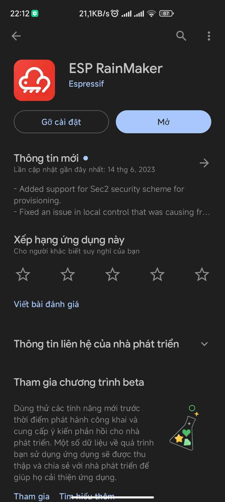
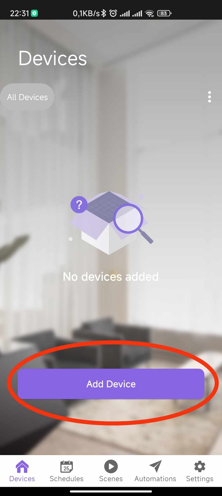
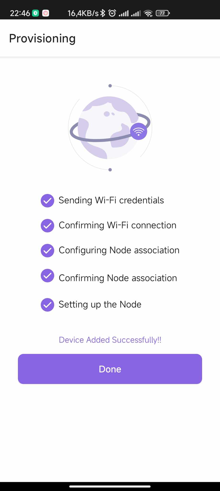
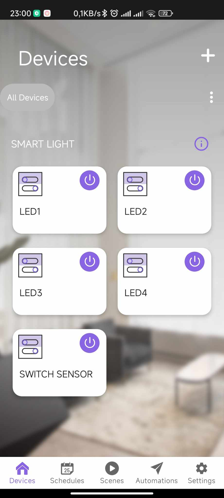

# Like_sensor_sys
- ESP32 as main microController
- Light Sensor (BH1750FVI) using I2C protocol
- Using ESP Rainmaker to control devices
# Hướng dẫn sử dụng

## Về phần app sử dụng trong dự án: Bạn có thể tải ứng dụng ESP Rainmaker trên CH Play hoặc APP Store

+ Sau đó người dùng đăng nhập vào ứng dụng, nếu chưa có tài khoản có thể đăng ký theo hướng dẫn của ứng dụng 
`**Sau khi đã tải ứng dụng và đăng kí tài khoản thành công người dùng sẽ làm theo các bước sau để kết nối thiết bị với ứng dụng**`
## Bước 1: Về phần cứng, khi sử dụng lần đầu hoặc muốn đổi wifi của thiết bị, nhấn và giữ nút boot trong 5s

## Bước 2: Vào ứng dụng ESP RainMaker, xuất hiện giao diện như bên dưới, vui lòng bật bluetooth và vị trí trên điện thoại của bạn để có thể cấp quyền phục vụ cho việc kết nối với thiết bị

## Bước 3: Sau khi nhấn ADD DEVICE màn hình sẽ hiện ra mục quét QR
[Đây là link để có thể hiển thị mã QR của thiết bị](https://rainmaker.espressif.com/qrcode.html?data={%22ver%22:%22v1%22,%22name%22:%22PROV_12345%22,%22pop%22:%221234567%22,%22transport%22:%22ble%22})
- Nếu như muốn kết nối với thiết bị mà không cần quét QR bạn có thể lựa chọn mục "I don't have QR code" để có thể kết nối với bluetooth của thiết bị, sau đó chọn mục "BLE" sau đó ứng dụng sẽ hiển thị tên bluetooth của thiết bị là "PROV_12345" và mật khẩu sẽ là "1234567"

## Bước 4: Kết nối được với thiết bị thông qua bluetooth xong, tiếp theo sẽ là lựa chọn wifi để thiết bị có thể kết nối
- Bạn hãy đặt thiết bị trong môi trường có mạng wifi 2.4GHz, lựa chọn mạng và nhập mật khẩu trên ứng dụng sau đó nhấn "START" để thiết bị bắt đầu quá trình kết nối
- Khi mà kết nối thành công với wifi, bạn sẽ đợi trong một vài phút trên ứng dụng để có thể hoàn thành set up và trên phần cứng đèn xanh sẽ nhấp nháy nếu thiết bị đã kết nối được với wifi. Và nếu wifi chưa được kết nối bạn cần làm lại từ bước 1

## Như thế là đã hoàn thành xong set up cho ứng dụng và thiết bị

# Tính năng của thiết bị
- Thiết bị được chia ra thành 2 hướng sử dụng đó là bật tắt đèn bằng ứng dụng và bật tắt đèn bằng cảm biến ánh sáng
- Dưới đây là hình ảnh tổng quan trên ứng dụng sau khi set up thành công (Bật: Nút sáng tím, Tắt: nút sáng trắng)

- Nút SWITCH SENSOR trên ứng dụng có tác dụng chuyển đổi việc bật tắt bằng cảm biến hoặc bằng ứng dụng, khi mà nút SWITCH SENSOR bật LED1 sẽ được bật tắt theo cảm biến ánh sáng và mức ánh sáng được set để bật tắt ở đây chỉ là thử nghiệm(hiện tại đang set dưới 58lx thì sẽ turn on Relay), khi nút này tắt LED1 sẽ được điều khiển hoàn toàn trên ứng dụng
- LED2, LED3, LED4 chỉ có thể bật tắt bằng ứng dụng
